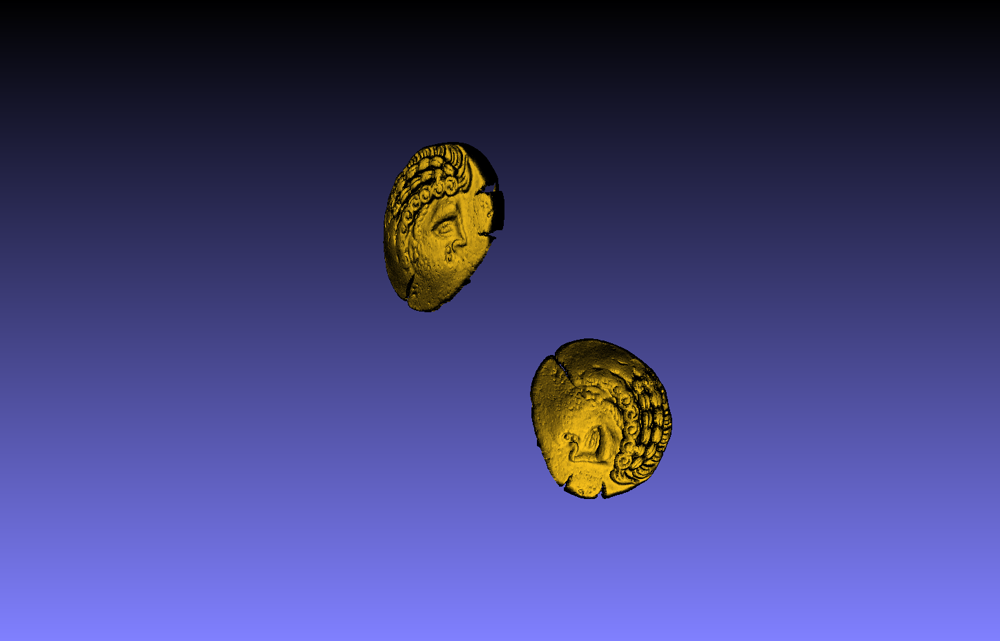
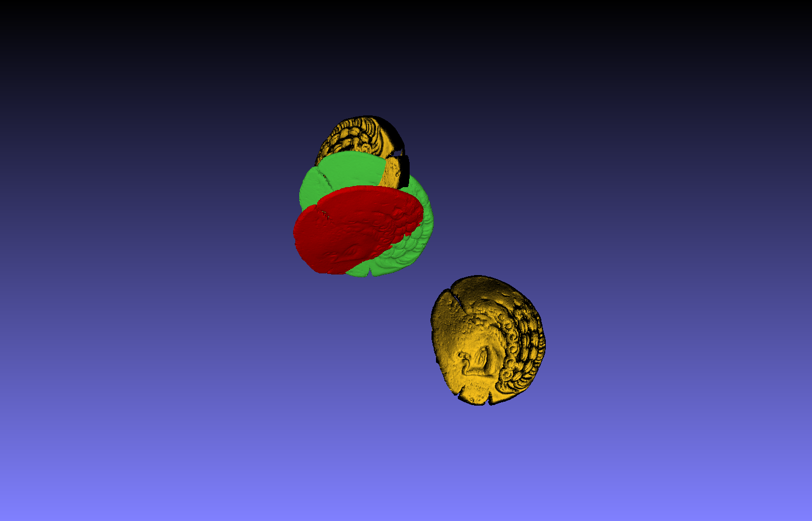

# Is Plane-to-Plane ICP really usefull ?

complete study of Generalized ICP for rigid registration of 3D point clouds. Implemented using the Gauss-Newton algorithm with Lie algebra updates. I evaluated the method on the Riedones3D coin benchmark.

<table>
  <tr>
    <td align="center">
      
      <br>
      <em>Source (bottom) and target (top).</em>
    </td>
    <td align="center">
      
      <br>
      <em>ICP in red vs GICP in green (2 its).</em>
    </td>
  </tr>
</table>

**Project Architecture**

| Area | Path | Role |
| --- | --- | --- |
| Core algorithms | `src/` | ICP and GICP implementations |
| Public headers | `include/` | Shared interfaces and math utilities |
| Coin benchmark | `examples/coin_benchmark.cpp` | Full Riedones3D benchmark (ICP vs GICP, SRE/SSE logging) |
| Coin demo | `examples/gicp_icp_coin.cpp` | Single-coin demo with controlled perturbations |
| Noise robustness | `examples/noise_robustness.cpp` | Jitter + rotation + translation sweep (RMSE logging) |
| Dataset | `Riedones3D_Registration_Benchmark/` | Coin point clouds and pair lists |
| Results | `logs/` | Run outputs (CSV + metadata) |
| Figures | `img/` | Report-ready images |

Before running the GICP experiments, download the Riedones3D dataset and place it in the repo root (`Riedones3D_Registration_Benchmark/`): https://cloud.minesparis.psl.eu/index.php/s/AVhOXp54IVGYLTM *(Segal et al., 2009; Horache et al., 2021)*.

**Build**

```bash
cmake -B build -S .
cmake --build build -j
```

**Run: Coin Benchmark (Riedones3D)**

```bash
./build/coin_benchmark \
  --dataset_root Riedones3D_Registration_Benchmark/test \
  --max_iter 20 \
  --k_neighbors 20 \
  --epsilon 1e-3 \
  --sample_ratio 1.0 \
  --log_dir logs
```

**Run: Single-Coin Demo**

```bash
./build/gicp_icp_coin \
  --input Riedones3D_Registration_Benchmark/test/die_obverse_0001/L0001D.ply \
  --angle_deg 10 \
  --trans_norm 0.01 \
  --noise_sigma 0.001 \
  --max_iter 20
```

**Run: Jitter Robustness Sweep**

```bash
./build/riedones3d_noise \
  --dataset_root Riedones3D_Registration_Benchmark/test \
  --num_pieces 5 \
  --jitter_list 0.001,0.01,0.1 \
  --rot_deg_list 50,100 \
  --trans_list 0,0.005,0.01 \
  --max_iter 20 \
  --log_dir logs
```

**Results and Outputs**

- Coin benchmark logs: `logs/coins_YYYYMMDD_HHMMSS/results.csv` and `logs/coins_YYYYMMDD_HHMMSS/summary.txt`
- Noise robustness logs: `logs/riedones3d_noise_YYYYMMDD_HHMMSS/results.csv`, `logs/riedones3d_noise_YYYYMMDD_HHMMSS/summary.csv`, and `logs/riedones3d_noise_YYYYMMDD_HHMMSS/metadata.txt`

